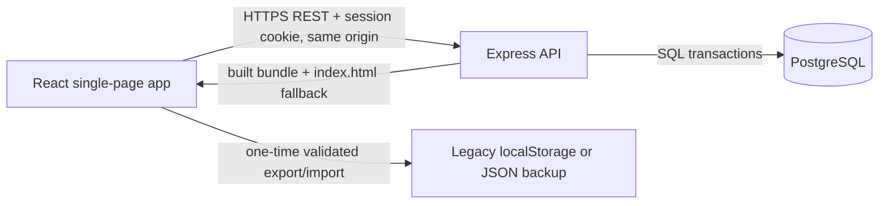

# Target architecture

## Product boundary

Poker Range Trainer remains a focused Texas Hold'em preflop range-training
application. It keeps the range editor, library management, drills, spaced
repetition, progress analytics, backup/import, and reset behavior. Archived
postflop, sharing, solver, frequency, combo, and AI features remain out of scope.

The existing Expo application and local-only implementation remain intact until a
validated import-first migration path exists. The new web app becomes the
production product; the mobile code is retained as a legacy data source during
the transition.

## Containers and responsibilities



### Web front end

The web app is a Vite-built React single-page app on React Router
([ADR 0002](../adr/0002-vite-react-spa-served-by-express.md)). It owns the
route table, accessible responsive UI, optimistic interaction states, and an API
client. It does not implement authorization rules, write domain records
directly, or duplicate business logic. There is no server rendering: every page
loads its data from the Express API in the browser, and in production Express
serves the built bundle so the app and the API share one origin.

### Express API

Express is the only authority for authentication, authorization, request
validation, domain use cases, persistence, import processing, and structured
logging. Routes are versioned under `/api/v1`; controllers stay thin and call the
shared domain/application layer. The API owns PostgreSQL transactions and is the
only process with database credentials. In production it also serves the web
bundle: hashed assets with an immutable cache and `index.html` for any other
page URL, mounted after the API routes so an unknown `/api` path still answers
with problem+json.

### Shared packages

`packages/domain` contains framework-neutral poker-hand vocabulary, range math,
drill scoring, scheduling, and analytics calculations. `packages/contracts`
contains shared request/response types and validation schemas for the REST API.
Browser code may use deterministic read-only domain calculations and contracts.
Rules that change or reveal user data are always enforced by Express, even when
a matching client helper exists.

### PostgreSQL

PostgreSQL is the durable system of record. Schema migrations create constraints,
indexes, and seed data. See [ADR 0001](../adr/0001-postgresql-over-nosql.md) and
[data and migration design](data-and-migration.md).

## API, authentication, and errors

The REST API has documented contracts and consistent envelopes. Successful
resource responses return `{ data }`; collection responses return `{ data, meta }`
without prescribing top-level pagination fields. Failures use the
`application/problem+json` content type and RFC 9457-style fields:

```json
{
  "type": "https://api.example.com/problems/validation-error",
  "title": "Validation failed",
  "status": 422,
  "detail": "One or more fields are invalid.",
  "instance": "/api/v1/ranges",
  "code": "VALIDATION_ERROR",
  "requestId": "...",
  "issues": [{ "field": "name", "message": "Required" }]
}
```

`requestId` is required on every problem response; `issues` is optional and is
used for field-level validation detail.

Authentication uses email/password with a slow password hash and secure,
HTTP-only, `Secure`, `SameSite=Lax` session cookies. Express enforces ownership
on every resource query and mutation. Registration and login are rate-limited.
CORS is an allowlist for the
frontend origin and permits credentials only for that origin. Input is schema
validated at the API boundary; logs contain request IDs and operational context,
never passwords, sessions, or full user data.

Initial resource groups are:

- `POST /auth/register`, `POST /auth/login`, `POST /auth/logout`, and
  `GET /auth/me`.
- `GET|POST /ranges`, `GET|PATCH|DELETE /ranges/:rangeId`, and restore/archive
  operations.
- `POST /practice-sessions` to atomically record a completed drill; read endpoints
  provide range statistics, Today, and Progress projections.
- `GET|PUT /settings/training-goal`.
- `POST /imports/legacy-backup` and `GET /exports/backup`.

## Security and operational baseline

Environment variables are parsed and fail fast at API startup; secrets never use
the browser-exposed `VITE_` prefix, and the web bundle carries no configuration
at all: it calls its own origin. Production configuration requires a
database URL, session secret, allowed frontend origin, and explicit runtime mode.
The API applies HTTPS-aware cookies, CORS, rate limits, payload limits, security
headers, structured JSON logging, health/readiness endpoints, and centralized
error middleware. Database migration, backup, and deployment commands are
documented alongside Docker development.

## Key tradeoffs

- A thin browser client and one API process keep auth and persistence logic in a
  single place and make the API independently testable; the trade is that there
  is no path to server rendering without reintroducing a framework (ADR 0002).
- Session cookies fit a browser-first product and reduce token exposure; they
  require deliberate CSRF-aware same-site/origin policy.
- Derived practice records are persisted for fast library and progress reads,
  while session records remain the audit trail.
- Offline-first synchronization is not part of this rebuild. The legacy app keeps
  working during migration, and the new web app clearly represents network
  loading and failure states.
